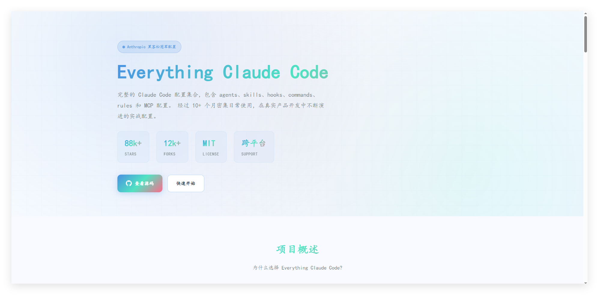
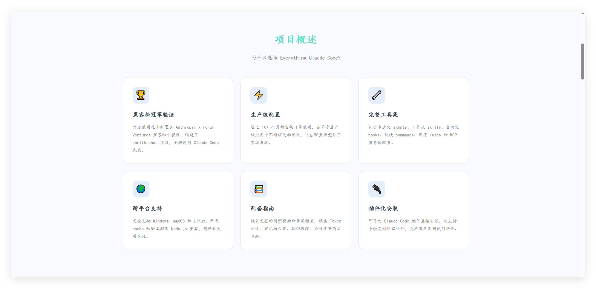
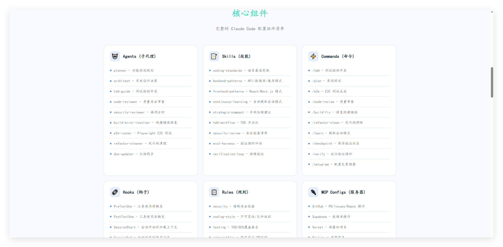

# Everything Claude Code - 学习版

## 📖 项目简介

这是一个使用 Vue 3 + Vite 构建的静态网站，学习了 "Everything Claude Code" 的安装使用方案

**作者：** 南宫乘风

  

## ✨ 特性

- 🌊 **清新海风蓝** - 浅蓝+白+青绿色+珊瑚粉配色方案
- 📱 **响应式设计** - 完美适配移动端和桌面端
- ⚡ **Vue 3** - 使用 Composition API 和 `<script setup>` 语法
- 🎯 **交互完整** - 标签页切换、代码复制、平滑滚动
- 📝 **楷体字体** - 优雅的中文字体展示 


## 🚀 快速开始

### 安装依赖

```bash
npm install
```

### 启动开发服务器

```bash
npm run dev
```

### 构建生产版本

```bash
npm run build
```

### 预览生产版本

```bash
npm run preview
```

## 📁 项目结构

```
.
├── index.html              # HTML 入口文件
├── package.json            # 项目配置
├── vite.config.js          # Vite 配置
├── README.md               # 项目说明文档
└── src/
    ├── main.js             # 应用入口
    ├── App.vue             # 主应用组件
    ├── style.css           # 全局样式
    ├── data.js             # 页面数据
    └── components/         # 组件目录
        ├── HeroSection.vue          # Hero 区域
        ├── FeaturesSection.vue      # 项目概述
        ├── ComponentsSection.vue    # 核心组件
        ├── HooksSection.vue         # 智能 Hooks
        ├── InstallationSection.vue  # 安装指南
        ├── TipsSection.vue          # 使用建议
        ├── LearningSection.vue      # 学习主题
        ├── AuthorSection.vue        # 作者信息
        └── Footer.vue               # 页脚
```

## 🎯 页面组件

### 1. HeroSection
- 网站标题和副标题
- 统计数据展示（Stars、Forks、License、Support）
- CTA 按钮（查看源码、快速开始）

### 2. FeaturesSection
6个功能特性卡片：

- 🏆 黑客松冠军验证
- ⚡ 生产级配置
- 🔧 完整工具集
- 🌍 跨平台支持
- 📚 配套指南
- 🔌 插件化安装



### 3. ComponentsSection

6个核心组件展示：
- 🤖 Agents (子代理)
- 📝 Skills (技能)
- ⚡ Commands (命令)
- 🔗 Hooks (钩子)
- 📋 Rules (规则)
- 🔌 MCP Configs (服务器)

  

### 4. HooksSection
6个智能 Hooks 自动化功能：
- 阻止 dev server 在 tmux 外运行
- TypeScript 自动类型检查
- Prettier 自动格式化
- console.log 警告
- 会话状态持久化
- PR 创建后自动提示

### 5. InstallationSection
3种安装方式（标签页切换）：
- 插件安装 (推荐)
- 手动安装
- 配置文件

**功能：** 一键复制代码到剪贴板

### 6. TipsSection
4个使用建议：
- ⚠️ 上下文窗口管理
- 🎯 个性化定制
- 📖 阅读指南
- 🔄 包管理器检测

### 7. LearningSection
6个指南涵盖主题：
- 🎛️ Token 优化
- 💾 记忆持久化
- 📈 持续学习
- ✅ 验证循环
- 🔀 并行化
- 🎭 子代理编排

### 8. AuthorSection
作者信息展示：
- 头像
- 姓名（南宫乘风）
- 头衔
- 个人简介
- 社交媒体链接

### 9. Footer
页脚信息：
- 项目链接
- License 信息
- 访问量统计

## 🎨 配色方案

### 清新海风蓝（方案一）

```css
--primary-color: #4A90E2;
--primary-dark: #357ABD;
--primary-light: #6BA3E8;
--secondary-color: #50E3C2;
--accent-color: #FF6B8A;
--background-color: #F8FAFF;
--surface-color: #FFFFFF;
--surface-light: #F0F7FF;
--text-color: #2C3E50;
--text-muted: #7F8C8D;
--border-color: #D4E5F7;
--code-bg: #F5F9FF;
```

**配色说明：**
- 🔵 主色：浅蓝色 (#4A90E2)
- 🟢 辅助色：青绿色 (#50E3C2)
- 🌸 强调色：珊瑚粉 (#FF6B8A)
- ⬜ 背景：极浅蓝白 (#F8FAFF)
- ⚪ 表面：纯白 (#FFFFFF)

## 🛠️ 技术栈

- **框架**: Vue 3.4+
- **构建工具**: Vite 5.0+
- **样式**: 原生 CSS + CSS 变量
- **字体**: 楷体 (KaiTi / STKaiti)
- **开发语言**: JavaScript


### 配色方案
从深色紫色主题变更为 **清新海风蓝主题**：
- 主色：浅蓝 (#4A90E2)
- 辅助色：青绿 (#50E3C2)
- 强调色：珊瑚粉 (#FF6B8A)
- 背景：浅蓝白 (#F8FAFF)
- 表面：纯白 (#FFFFFF)


## 🙏 致谢

- 原项目: [affaan-m/everything-claude-code](https://github.com/affaan-m/everything-claude-code)
- 作者: Affaan Mustafa (原版) / 南宫乘风 
